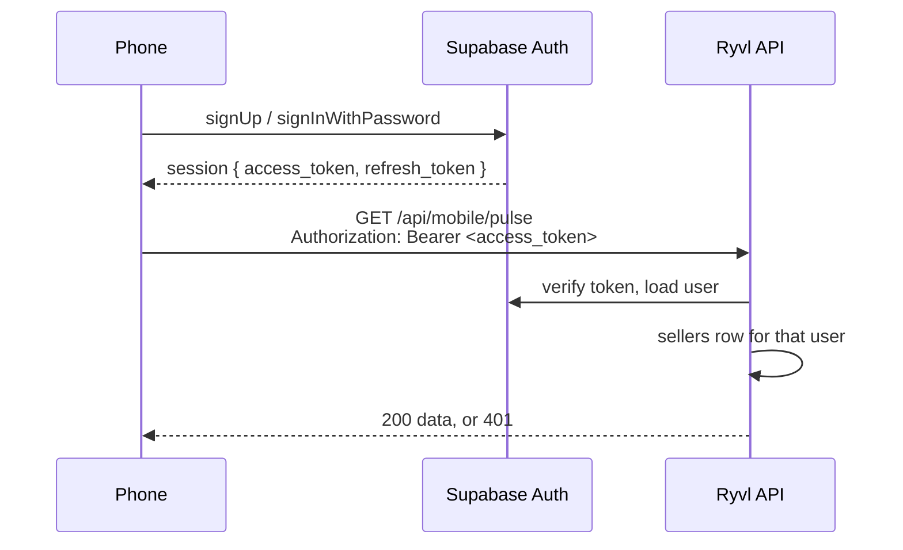

# Mobile Auth — login, signup, session

**For:** the mobile client developer. Companion to [MOBILE_API.md](MOBILE_API.md), which covers every data endpoint. This one covers how a phone gets the token those endpoints need.

**As of:** 2026-09-18. Everything here is read from the code and cited by path. Where something does not exist yet, it says so in [What does not exist yet](#what-does-not-exist-yet) rather than guessing.

---

## The one thing to know

**There is no login or signup endpoint in this codebase, and the mobile API does not need one.**

Login and signup are Supabase Auth, called from the client with the public anon key — the same one the web app uses. The Ryvl server never sees a password. It only sees the access token that Supabase hands back, and every `/api/mobile/*` route reads that token the same way.



**Server side, verbatim from `app/src/lib/supabase/server.ts`:**

| Function | Does |
|---|---|
| `getBearerToken(request)` | Reads the `Authorization` header. Any scheme other than `Bearer`, or an empty token → `null`. |
| `createBearerClient(accessToken)` | Supabase client with that token, `persistSession: false`, `autoRefreshToken: false`. **The server never refreshes a token.** |
| `getSellerFromRequest(request)` | `auth.getUser()` with the token, then the `sellers` row for that user. `null` if either fails. |

`requireMobileSeller()` in `app/src/lib/mobile/respond.ts` wraps all three and adds the plan check. Same identity path as the web, on purpose — a plan gate that held on the browser but not the phone would be a paywall hole.

---

## Configuration the phone needs

Two values, both public, both already used by the web app's browser bundle:

| Name | Where it comes from | Used for |
|---|---|---|
| `SUPABASE_URL` | Supabase Dashboard → Project Settings → Data API → Project URL | Auth calls |
| `SUPABASE_ANON_KEY` | Same page → `anon` `public` key | Auth calls |

Never the `service_role` key. It bypasses row-level security and must not ship in a client.

The Ryvl API base URL is the web app's host. Paths in this doc are relative to it, same as [MOBILE_API.md](MOBILE_API.md).

---

## Sign up

### The call

Verbatim from `app/src/app/auth/_components/SignUpForm.tsx`. The phone must make the same call with the same two metadata keys, or the seller row is created wrong.

```ts
const { data, error } = await supabase.auth.signUp({
  email,
  password,
  options: {
    data: {
      business_name: businessName,   // required by the trigger; defaults to 'My Store' if absent
      referral_code: referralCode ?? '',   // optional; '' means none
    },
  },
});
```

### Request (what the SDK sends)

`POST {SUPABASE_URL}/auth/v1/signup`

```jsonc
// headers
{
  "apikey": "<SUPABASE_ANON_KEY>",
  "Content-Type": "application/json"
}

// body
{
  "email": "seller@example.com",
  "password": "Str0ng!Pass",
  "data": {
    "business_name": "Karachi Coffee Co.",
    "referral_code": ""
  }
}
```

### Response (SDK shape)

**Email confirmation is on.** Until the person clicks the link in the email, there is no session.

```jsonc
{
  "data": {
    "user": {
      "id": "8f0c…",                       // auth.users.id — the sellers.user_id
      "email": "seller@example.com",
      "email_confirmed_at": null,          // null until the link is clicked
      "user_metadata": {
        "business_name": "Karachi Coffee Co.",
        "referral_code": ""
      }
      // …other Supabase user fields
    },
    "session": null                        // ← no token yet
  },
  "error": null
}
```

The web form branches on exactly this:

```ts
if (!data.session) {
  // show "Check your email — we sent a confirmation link"
  return;
}
```

The phone must do the same. There is no bearer token until confirmation, so nothing under `/api/mobile/*` can be called yet.

### What the database does with it

A trigger on `auth.users` (`scraper/migrations/013_seller_signup_trigger.sql`, extended by `018_referral_integrity.sql`) creates the `sellers` row. It reads **exactly two** keys from `user_metadata`:

| Metadata key | Written to | If absent |
|---|---|---|
| `business_name` | `sellers.business_name` | `'My Store'` |
| `referral_code` | Looked up in `seller_referrals`; a match records the referral | Trimmed; `''` = no code |

Nothing else in the metadata is read. The trigger does not set a plan — `sellers.plan_tier` takes its column default, `'free'` (`011_create_seller_platform_tables.sql`). Nothing at signup can choose a tier.

### Password rules

The web form validates against `PASSWORD_RULES` in `app/src/lib/password.ts` **before** calling `signUp`. Use the same list so the phone's messages match the web's:

| Rule | Test | Message shown |
|---|---|---|
| length | `p.length >= 8` | At least 8 characters |
| uppercase | `/[A-Z]/` | One uppercase letter |
| lowercase | `/[a-z]/` | One lowercase letter |
| number | `/[0-9]/` | One number |
| special | `/[^A-Za-z0-9]/` | One special character |

These are client-side UX. The **enforced** policy is a Supabase dashboard setting (`SECURITY.md`, deploy step 2), which is required to mirror these five. See [What does not exist yet](#what-does-not-exist-yet) — whether that dashboard setting is in place cannot be verified from code.

### Errors from `signUp`

Come back in `error.message`. The web form shows the message as-is.

| `error.message` | When | Notes |
|---|---|---|
| `Email address "…" is invalid` | Supabase rejects the domain (e.g. `example.com`) | Seen in testing, 2026-09-08 |
| `email rate limit exceeded` | Supabase's built-in sender cap — a few emails per **hour, project-wide** | Seen in testing, 2026-09-08. Every signup sends one email. Repeated test signups hit this within minutes. Not a code error. |

Signing up with an email that already has an account: with email confirmation on, Supabase deliberately returns a response that looks like a fresh signup (no error, `session: null`) rather than revealing the account exists. The phone should show the same *"check your email"* screen. Not observed in this project; this is Supabase's documented enumeration protection.

---

## Log in

### The call

Verbatim from `app/src/app/auth/_components/SignInForm.tsx`:

```ts
const { data, error } = await supabase.auth.signInWithPassword({ email, password });
```

### Request (what the SDK sends)

`POST {SUPABASE_URL}/auth/v1/token?grant_type=password`

```jsonc
// headers
{
  "apikey": "<SUPABASE_ANON_KEY>",
  "Content-Type": "application/json"
}

// body
{
  "email": "seller@example.com",
  "password": "Str0ng!Pass"
}
```

### Response (SDK shape)

```jsonc
{
  "data": {
    "user": { "id": "8f0c…", "email": "seller@example.com" /* … */ },
    "session": {
      "access_token": "eyJhbGciOi…",     // ← the bearer token for /api/mobile/*
      "refresh_token": "v1.MR…",
      "token_type": "bearer",
      "expires_in": 3600,
      "expires_at": 1758200000,
      "user": { /* same user */ }
    }
  },
  "error": null
}
```

`session.access_token` is the value to send on every Ryvl API call. Same token the web app uses. There is no separate mobile token and no API key.

### One error message for two causes, on purpose

Supabase returns the same text whether the password is wrong **or** no account exists for that email:

```jsonc
{ "data": { "user": null, "session": null }, "error": { "message": "Invalid login credentials" } }
```

The web form's own comment explains why: saying *"no account exists"* would let anyone enumerate registered emails. **Do not try to tell the two apart or improve on the message.**

### Immediately after login: register the device

`POST /api/mobile/devices` — Live · no plan gate

```bash
curl -X POST https://<host>/api/mobile/devices \
  -H "Authorization: Bearer $ACCESS_TOKEN" \
  -H "Content-Type: application/json" \
  -d '{"pushToken":"ExponentPushToken[xxxx]","platform":"ios","appVersion":"1.0.0"}'
```

```jsonc
// request
{
  "pushToken": "ExponentPushToken[…]",   // required
  "platform": "ios",                     // required: "ios" | "android"
  "appVersion": "1.0.0"                  // optional; truncated to 32 chars server-side
}

// response 200
{ "succeeded": true, "data": { "registered": true }, "errors": [], "message": "OK" }
```

[MOBILE_API.md](MOBILE_API.md) says to call this **on every app launch**, not only at login — Expo tokens rotate. The write is an upsert keyed on the token, so repeat calls don't create duplicate rows.

---

## Using the token

Every `/api/mobile/*` request:

```
Authorization: Bearer <session.access_token>
```

```bash
curl https://<host>/api/mobile/pulse \
  -H "Authorization: Bearer $ACCESS_TOKEN"
```

Get the current token from the SDK each time rather than caching it yourself — `supabase.auth.getSession()` returns the live one, refreshed if needed:

```ts
const { data: { session } } = await supabase.auth.getSession();
const token = session?.access_token;   // null → not signed in
```

---

## Session and refresh

**Refresh is the phone's job.** `createBearerClient()` on the server is built with `autoRefreshToken: false`. The server verifies the token it is handed and nothing more. The Supabase SDK on the phone refreshes on its own; the phone sends whatever `getSession()` currently returns.

If you need to force it (e.g. after a `401`):

```ts
const { data, error } = await supabase.auth.refreshSession();
// data.session.access_token is the new token, or error if the refresh token is gone
```

### `401` from any mobile route

Means one of three things, and the route **cannot tell you which**: no token, an expired token, or a valid token for a user with no `sellers` row.

```jsonc
// response 401
{
  "succeeded": false,
  "data": null,
  "errors": ["Send the Supabase session access token as: Authorization: Bearer <token>"],
  "message": "Not authenticated"
}
```

Documented handling ([MOBILE_API.md](MOBILE_API.md), Errors): **refresh the session; if that fails, sign out.**

### `403` from a gated route

Raised by `requireMobileSeller()` when the route is called with a feature name and `hasFeature(planTier, feature)` is false. The body names the feature.

```jsonc
// response 403
{
  "succeeded": false,
  "data": null,
  "errors": ["Your plan does not include competitor intel."],
  "message": "Upgrade required"
}
```

Which routes gate on which feature is listed per endpoint in [MOBILE_API.md](MOBILE_API.md). Show an upgrade prompt; do not retry.

---

## Sign out

**Two calls, in this order.** The order matters: step 1 needs the bearer token that step 2 discards.

### 1. Unregister the device

`DELETE /api/mobile/devices` — Live · no plan gate

```bash
curl -X DELETE https://<host>/api/mobile/devices \
  -H "Authorization: Bearer $ACCESS_TOKEN" \
  -H "Content-Type: application/json" \
  -d '{"pushToken":"ExponentPushToken[xxxx]"}'
```

```jsonc
// request
{ "pushToken": "ExponentPushToken[…]" }

// response 200
{ "succeeded": true, "data": { "removed": true }, "errors": [], "message": "OK" }
```

[MOBILE_API.md](MOBILE_API.md) marks this **not optional**: without it, a shared or resold phone keeps receiving the previous seller's alerts until the token happens to rotate.

### 2. End the session

```ts
await supabase.auth.signOut();
```

Sends `POST {SUPABASE_URL}/auth/v1/logout` with the bearer token and clears the local session.

---

## Password reset

Exists on the web (`app/src/app/auth/password-reset/page.tsx`), verbatim:

```ts
const { error } = await supabase.auth.resetPasswordForEmail(email);
```

`POST {SUPABASE_URL}/auth/v1/recover` with `{ "email": "…" }`. Sends an email with a reset link. **The link lands on the web app** — see [What does not exist yet](#what-does-not-exist-yet).

---

## Error reference

### From Supabase Auth (`signUp`, `signInWithPassword`, `resetPasswordForEmail`)

Returned as `{ error: { message } }` on the SDK call. Show `error.message`.

| `error.message` | Call | When |
|---|---|---|
| `Invalid login credentials` | login | Wrong password **or** no account. Deliberately indistinguishable. |
| `Email address "…" is invalid` | signup | Rejected domain |
| `email rate limit exceeded` | signup, reset | Project-wide sender cap, a few per hour |

### From the Ryvl API (every `/api/mobile/*` route)

Standard envelope. Branch on the HTTP status.

| Status | Means | Do |
|---|---|---|
| `401` | No / expired / unrecognised token, or no seller row | Refresh session; if that fails, sign out |
| `403` | Plan doesn't include the feature | Show upgrade prompt |

---

## What does not exist yet

Each row is something the code does not do today. None is a recommendation. Each needs a decision before the phone can rely on it.

| Gap | What the code does now | What is missing |
|---|---|---|
| **Confirmation link opening the app** | `signUp()` is called with no `emailRedirectTo`. The link in the confirmation email lands wherever Supabase's Site URL points — the web app. | A URL that opens the mobile app, passed as `options.emailRedirectTo`, and added to Supabase's allowed redirect list (Dashboard → Authentication → URL Configuration). Until then, a phone signup confirms in a browser tab. |
| **Password-reset link opening the app** | `resetPasswordForEmail(email)` with no redirect. The link lands on the web. | Same as above, passed as `{ redirectTo }`. |
| **Social login** | None. Email + password only, in both forms. | Whether to add any. (If Google or similar is added on iOS, App Store review also requires Sign in with Apple.) |
| **Email sending under real load** | The default Supabase sender, rate-limited to a few emails per hour project-wide. Hit during testing on 2026-09-08. | Custom SMTP (Dashboard → Authentication → SMTP Settings), or accept that signups throttle. |
| **Server-side password policy** | `SECURITY.md` deploy step 2 says to set it in the dashboard. Nothing in the repo records whether that was done. | Confirm Dashboard → Authentication → Policies matches the five `PASSWORD_RULES`. Cannot be verified from code. |
| **A Ryvl-owned auth endpoint** | None, by the existing design: the phone talks to Supabase Auth directly and the API only consumes the token. | Only needed if the server should be in the loop at signup (e.g. to accept a device or a plan in the same call). Nothing today requires it. |

The first two rows are the ones a phone build hits on day one. Everything above this table works today for a phone exactly as it works for the browser.

---

## Sources (all in this repo)

- `app/src/app/auth/_components/SignUpForm.tsx` — the signup call and the `data.session` check
- `app/src/app/auth/_components/SignInForm.tsx` — the login call and the enumeration note
- `app/src/app/auth/password-reset/page.tsx` — the reset call
- `app/src/lib/password.ts` — `PASSWORD_RULES`
- `app/src/lib/supabase/server.ts` — `getBearerToken`, `createBearerClient`, `getSellerFromRequest`
- `app/src/lib/mobile/respond.ts` — `requireMobileSeller`, the `401`/`403` bodies
- `app/src/app/api/mobile/devices/route.ts` — register / unregister
- `scraper/migrations/011_create_seller_platform_tables.sql` — `plan_tier` default
- `scraper/migrations/013_seller_signup_trigger.sql`, `018_referral_integrity.sql` — what signup writes
- `SECURITY.md` — deploy step 2, password policy
- [MOBILE_API.md](MOBILE_API.md) — the data endpoints this token unlocks
